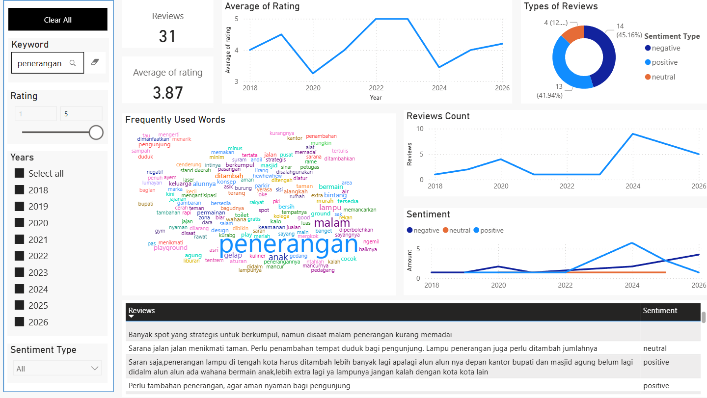
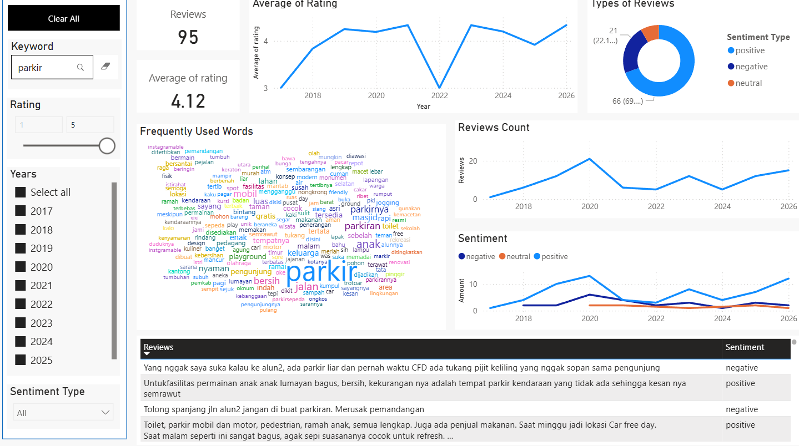

# 📊 Analisis Ulasan Publik Alun-Alun Lumajang (2014 – Awal 2026)

## 1. Gambaran Proyek
Proyek ini menganalisis persepsi publik terhadap **Alun-Alun Lumajang** berdasarkan ±4.900 ulasan Google selama periode 2014 hingga awal 2026.  

Analisis dilakukan untuk:
- Mengukur sentimen pengunjung secara keseluruhan
- Mengidentifikasi isu spesifik yang sering dikeluhkan
- Melihat perkembangan isu dari waktu ke waktu

---

## 2. Data
- Sumber: Google Reviews (scraping)
- Periode: 2014 – awal 2026
- Atribut mentah:
  - `review_id`
  - `review_text`
  - `rating`
  - `review_date`

---

## 3. Metodologi

### 3.1 Preprocessing
Dilakukan menggunakan Python:
- Lowercasing
- Penghapusan URL & karakter non-alfabet
- Normalisasi teks
- Pembersihan noise

### 3.2 Pelabelan Sentimen
Sentimen dilabeli menggunakan model **IndoBERT pre-trained**:

Model:
https://huggingface.co/crypter70/IndoBERT-Sentiment-Analysis

Catatan penting:
- Model bukan dilatih khusus untuk dataset ini
- Beberapa review mengandung **sentimen campuran (positif + negatif)**
- Oleh karena itu, analisis isu menggunakan **keyword searching dilakukan pada seluruh sentimen (positif & negatif)** untuk menangkap konteks lebih luas

---

## 4. Hasil Analisis Umum

- Rata-rata rating: **4,61**
- Sentimen positif: **86,33%**
- Kata dominan:
  - bersih
  - nyaman
  - indah
  - keluarga
  - anak

📌 Secara umum, persepsi pengunjung sangat positif dan Alun-Alun Lumajang dipandang sebagai ruang publik yang nyaman dan ramah keluarga.

---

# 5. Analisis Isu Spesifik

Meskipun tingkat kepuasan tinggi, beberapa isu muncul secara konsisten.

---

## 5.1 Isu Sampah

### Insight
- Terdapat peningkatan pembahasan isu **sampah dalam satu tahun terakhir**
- Sebelumnya sempat mengalami penurunan
- Dibahas di berbagai jenis sentimen (tidak hanya negatif)

Masalah utama:
- Sampah berserakan
- Perilaku pengunjung membuang sampah sembarangan
- Kurangnya kesadaran masyarakat

📌 Isu ini bersifat **perilaku sosial dan pengelolaan kebersihan**

---

## 5.2 Isu Penerangan

### Insight
- Beberapa spot terlihat gelap pada malam hari
- Isu ini konsisten muncul hampir setiap tahun
- Mengurangi estetika dan kenyamanan malam hari

📌 Permasalahan ini berkaitan dengan pemeliharaan fasilitas penerangan

---

## 5.3 Isu Playground / Fasilitas Anak

### Insight
- Banyak ulasan menyebut fasilitas bermain anak mulai rusak
- Beberapa dianggap kurang aman
- Isu ini semakin dominan dalam 5 tahun terakhir

Temuan ini juga didukung oleh pemberitaan media:

- Radar Jember (Nov 2023):  
  https://radarjember.jawapos.com/lumajang/793232914/semakin-mangkrak-pemkab-pertimbangkan-penutupanplay-ground-alun-alun-lumajang

- Radar Jember (Des 2024):  
  https://radarjember.jawapos.com/lumajang/795475540/fasilitas-play-ground-alun-alun-lumajang-masih-jauh-dari-kota-ramah-anak

📌 Ini menunjukkan konsistensi antara data ulasan publik dan kondisi faktual di lapangan.

---

## 5.4 Isu Parkir

### Insight
- Masih marak parkir liar
- Tata kelola parkir dinilai kurang optimal
- Lahan parkir dirasa kurang saat momen padat pengunjung
- Parkir sembarangan di sudut-sudut alun-alun

📌 Isu ini berkaitan dengan manajemen ruang dan pengawasan

---

# 6. Ringkasan Insight Utama

1. Tingkat kepuasan pengunjung sangat tinggi (86% positif)
2. Isu kebersihan meningkat kembali dalam setahun terakhir
3. Penerangan malam hari menjadi keluhan konsisten
4. Playground dan fasilitas anak menunjukkan tanda-tanda penurunan kualitas
5. Parkir liar masih menjadi masalah tata kelola

---

# 7. Keterbatasan Analisis

- Model sentimen menggunakan pre-trained model pihak ketiga
- Review dengan sentimen campuran bisa menyebabkan bias klasifikasi
- Tidak tersedia metadata demografis pengguna

Untuk meminimalkan bias, analisis dikombinasikan dengan:
- Keyword searching seluruh sentimen
- Analisis tren waktu
- Validasi konteks melalui kutipan review dan berita eksternal

---

# 8. Tools & Teknologi

- Python (Pandas, NLP preprocessing)
- IndoBERT (Sentiment Analysis)
- Power BI (Dashboard & Visualisasi)
- Word Cloud
- Exploratory Text Analysis

---

# 9. Kesimpulan

Secara keseluruhan, Alun-Alun Lumajang memiliki citra publik yang sangat positif.  
Namun, terdapat isu berulang terkait kebersihan, penerangan malam hari, fasilitas playground, dan pengelolaan parkir yang memerlukan perhatian berkelanjutan.

Analisis ini menunjukkan bagaimana data ulasan publik dapat digunakan untuk:
- Mengidentifikasi masalah spesifik
- Memantau tren isu dari waktu ke waktu
- Memberikan insight berbasis data untuk pengambilan kebijakan
