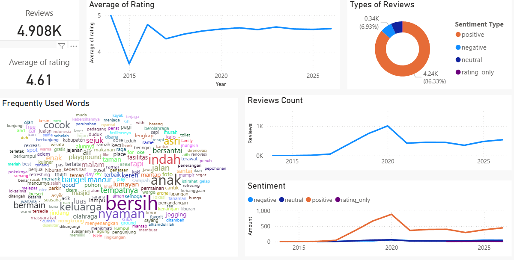
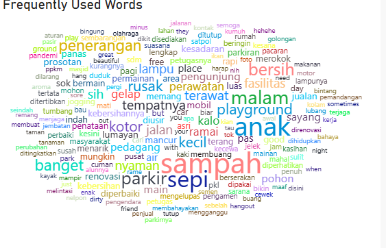
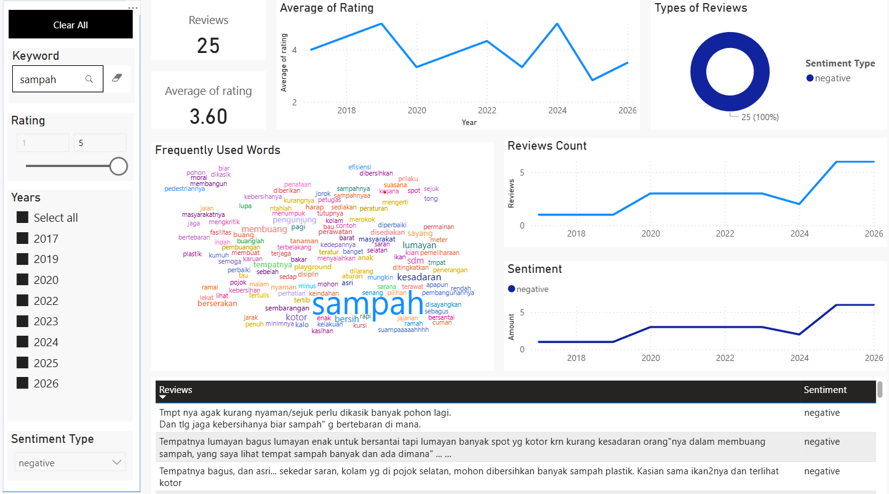

# 📊 Analisis Ulasan Publik Alun-Alun Lumajang (2014 – Awal 2026)

## 1. Gambaran Proyek
Proyek ini bertujuan untuk menganalisis persepsi publik terhadap **Alun-Alun Lumajang** berdasarkan ulasan Google yang dikumpulkan selama periode 2014 hingga awal 2026. Analisis difokuskan pada pemahaman sentimen pengunjung secara keseluruhan serta identifikasi isu-isu spesifik yang masih menjadi keluhan meskipun tingkat kepuasan relatif tinggi.

---

## 2. Rumusan Masalah
**Bagaimana persepsi pengunjung terhadap Alun-Alun Lumajang dalam jangka panjang, dan isu apa saja yang secara konsisten memunculkan ulasan negatif?**

---

## 3. Data
- **Sumber data**: Google Reviews (hasil scraping)
- **Periode waktu**: 2014 – awal 2026
- **Jumlah ulasan**: ±4.900
- **Atribut data mentah**:
  - `review_id`
  - `review_text`
  - `rating`
  - `review_date`

Data tidak memiliki metadata tambahan seperti profil pengguna atau kategori tempat.

---

## 4. Pra-pemrosesan Data
Seluruh proses pra-pemrosesan dilakukan menggunakan **Python**, meliputi:
- Konversi teks ke huruf kecil
- Penghapusan URL, emoji, dan karakter non-alfabet
- Normalisasi tanda baca dan spasi
- Penanganan ulasan tanpa teks (rating-only)

Pra-pemrosesan dilakukan untuk mengurangi noise tanpa menghilangkan makna semantik utama dari ulasan.

---

## 5. Pelabelan Sentimen
Pelabelan sentimen dilakukan menggunakan **model IndoBERT pra-latih** yang dikembangkan oleh pihak ketiga:

🔗 Referensi model:  
https://huggingface.co/crypter70/IndoBERT-Sentiment-Analysis

### Catatan Metodologis
- Model dilatih pada data berbahasa Indonesia dengan karakteristik yang mirip (ulasan publik).
- Label sentimen (*positif, negatif, netral*) diperlakukan sebagai **indikasi sentimen dominan**, bukan kebenaran absolut.
- Beberapa ulasan mengandung **sentimen campuran**, misalnya pujian yang disertai keluhan.

Untuk mengatasi keterbatasan tersebut, analisis sentimen dikombinasikan dengan **analisis berbasis kata kunci** dan **eksplorasi temporal**.

---

## 6. Metodologi Analisis
Pendekatan analisis yang digunakan meliputi:
- Analisis distribusi sentimen
- Analisis tren waktu (rating dan jumlah ulasan)
- Word cloud:
  - Seluruh ulasan
  - Ulasan negatif
  - Perbandingan lintas periode waktu
- Analisis isu berbasis kata kunci  
  Contoh kata kunci: `sampah`, `penerangan`, `parkir`, `playground`, `anak`

Visualisasi dan eksplorasi data disajikan dalam bentuk dashboard interaktif.

---

## 7. Hasil dan Temuan Utama

### 7.1 Persepsi Umum Pengunjung

- **Rata-rata rating**: 4,61 / 5
- **Ulasan positif**: 86,33%
- Kata kunci dominan:
  - *bersih*
  - *nyaman*
  - *indah*
  - *keluarga*
  - *anak*

➡️ Secara keseluruhan, Alun-Alun Lumajang dipersepsikan sangat positif sebagai ruang publik yang bersih, nyaman, dan ramah keluarga.

---

### 7.2 Analisis Sentimen Negatif

Meskipun proporsi ulasan negatif relatif kecil, beberapa isu muncul secara konsisten:
1. **Kebersihan dan pengelolaan sampah**
2. **Kurangnya penerangan pada malam hari**
3. **Kondisi fasilitas anak dan playground**
4. **Pengelolaan parkir**

Isu-isu ini bersifat spesifik dan berulang, bukan keluhan umum terhadap keseluruhan kawasan.

---

### 7.3 Analisis Temporal
<!--  -->
Perbandingan antara periode **2014–2026** dan **lima tahun terakhir (sejak 2022)** menunjukkan:
- Keluhan terkait **sampah** muncul secara konsisten sepanjang waktu
- Keluhan mengenai **penerangan malam hari** dan **fasilitas anak** meningkat pada periode terbaru
- Terjadi pergeseran fokus dari isu infrastruktur dasar menuju **kualitas pengalaman dan pemeliharaan fasilitas**

---

### 7.4 Analisis Isu Spesifik: Sampah

Hasil penyaringan ulasan negatif dengan kata kunci *sampah* menunjukkan:
- ±25 ulasan negatif secara eksplisit membahas sampah
- Rata-rata rating masih tergolong sedang (±3,6)
- Banyak ulasan menyoroti **perilaku pengunjung dan rendahnya kesadaran masyarakat**, bukan hanya kinerja petugas kebersihan

➡️ Masalah sampah dipersepsikan sebagai gangguan yang berulang, bukan kegagalan total pengelolaan.

---

## 8. Implikasi dan Rekomendasi
- **Pertahankan keunggulan**: kebersihan umum dan desain ramah keluarga
- **Tingkatkan konsistensi pengelolaan**:
  - Penambahan dan perawatan tempat sampah
  - Pemeliharaan lampu penerangan malam hari
  - Inspeksi rutin fasilitas playground
- **Pendekatan perilaku**:
  - Edukasi dan peningkatan kesadaran pengunjung

---

## 9. Keterbatasan
- Pelabelan sentimen bergantung pada model pra-latih pihak ketiga
- Ulasan dengan sentimen campuran dapat menimbulkan bias klasifikasi
- Tidak tersedia metadata pengguna untuk analisis demografis

Keterbatasan ini dikompensasi melalui pendekatan eksploratif, analisis kata kunci, dan tren waktu.

---

## 10. Tools & Skill yang Digunakan
- Python (data cleaning, preprocessing, analisis teks)
- NLP (sentiment analysis, word cloud)
- Dashboarding (Power BI / Looker Studio)
- Analisis eksploratif & diagnostik
- Interpretasi data untuk rekomendasi kebijakan

---

## 11. Ringkasan Portfolio
> Melakukan analisis lebih dari 4.900 ulasan publik selama 12 tahun menggunakan Python dan teknik NLP. Menggunakan model IndoBERT pre-trained sebagai baseline pelabelan sentimen dan mengombinasikannya dengan analisis berbasis kata kunci serta tren temporal untuk menghasilkan insight yang aplikatif bagi pengelolaan ruang publik.
